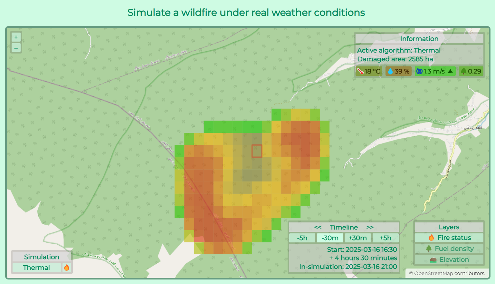

# Cellular Wildfire

Cellular Wildfire is a web application designed for wildfire simulation using a model based on cellular automata.

It utilizes predefined landscape and forest data along with real-time weather data to provide accurate simulations.

The model replicates the fire spread process by incorporating physical principles and insights from experimental observations.

## Implementation

The project is structured into three main modules:

1. [src](./src/README.md) - Backend module responsible for core simulation logic and data processing.
2. [frontend](./frontend/README.md) - Frontend module providing the web interface for visualization and interaction.
3. [data_processor](./data_processor/README.md) - Auxiliary module for processing forest and landscape data from open datasets.

## Development

Each module contains its own README file with development-specific details.
These files are located in the root directory of each module.

