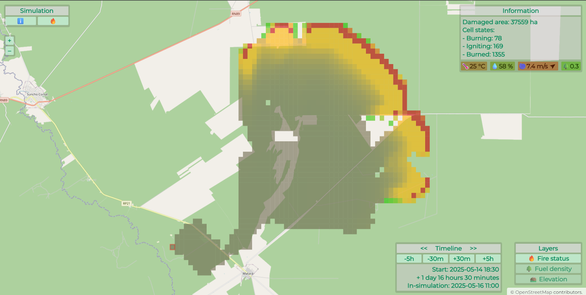

# Cellular Wildfire

Cellular Wildfire is a web application designed for wildfire simulation using a model based on a cellular automaton.

It utilizes predefined landscape and forest data along with real-time weather data to provide simulations.

The model's algorithm relies on physical principles and insights from experimental observations to produce accurate simulations.



## Implementation

The project consists of 3 parts:
1. [src](./src) - Backend part.
2. [frontend](./frontend) - Frontend part.
3. [data_processor](./data_processor) - Auxiliary part for landscape and forest data preparation.

Each part is described in its own *README.md* file.

## Deployment (as root user on Ubuntu 24.04 LTS)

Download necessary packages:
```sh
sudo apt update
sudo apt install -y maven openjdk-21-jdk nodejs npm
```

Clone the source repository:
```sh
cd /root
git clone https://github.com/axhse/cellular-wildfire
```

Download map resources from Hugging Face repository:
```sh
sudo apt install -y python3 python3-pip python3-venv
python3 -m venv .venv
source .venv/bin/activate
pip install -U huggingface_hub[cli]
huggingface-cli download axhse/cellular-wildfire-maps --repo-type=dataset --local-dir /root/cellular-wildfire/src/main/resources
```

Build the application (frontend part must be built by this point):
```sh
mvn clean package
```

The application needs a heap of at least 3GB. It can be achieved by increasing the sise of swap file:
```sh
sudo fallocate -l 3G /swapfile
sudo chmod 600 /swapfile
sudo mkswap /swapfile
sudo swapon /swapfile
```

Start the application in development mode with a mocked weather service:
```sh
mvn spring-boot:run
```

Or start the application in production mode by specifying the *WEATHER_API_KEY* environment
variable with an actual [WeatherAPI](https://www.weatherapi.com/) key:
```sh
WEATHER_API_KEY=0123456789abcdef0123456789abcde mvn spring-boot:run
```

The application runs on port 8080.

Landscape and forest maps are stored in backend resources in compressed format with Git LFS.  
They weight about 2GB in total after decompression.  
Some additional heap space is also needed to store active simulations.

The application server launcher may be configured as a service for easier management.  
This can be achieved with definition of a custom service */etc/systemd/system/cellular-wildfire-app.service*:
```ini
[Unit]
Description=Cellular Wildfire Application
After=network.target

[Service]
User=root
WorkingDirectory=/root/cellular-wildfire
Environment=WEATHER_API_KEY=0123456789abcdef0123456789abcde
ExecStart=/usr/bin/mvn spring-boot:run
Restart=no
RestartSec=10
StandardOutput=journal
StandardError=journal

[Install]
WantedBy=multi-user.target
```

This service needs to be started:
```sh
sudo systemctl daemon-reload
sudo systemctl enable cellular-wildfire-app.service
sudo systemctl start cellular-wildfire-app.service
```

Nginx should be configured in `/etc/nginx/nginx.conf` to handle HTTPS requests:
```nginx
user www-data;
worker_processes auto;
pid /run/nginx.pid;

events {
    worker_connections 1024;
}

http {
    include       mime.types;
    default_type  application/octet-stream;

    sendfile on;
    keepalive_timeout 65;

    access_log /var/log/nginx/access.log;
    error_log /var/log/nginx/error.log;

    gzip on;

    server {
        listen 80;
        server_name _;

        return 301 https://$host$request_uri;
    }

    server {
        listen 443 ssl;
        server_name _;

        ssl_certificate     /etc/nginx/ssl/cellular-wildfire-app-cert.pem;
        ssl_certificate_key /etc/nginx/ssl/cellular-wildfire-app-key.pem;

        ssl_protocols TLSv1.2 TLSv1.3;
        ssl_ciphers HIGH:!aNULL:!MD5;

        location / {
            proxy_pass http://localhost:8080;
            proxy_http_version 1.1;

            proxy_set_header Host $host;
            proxy_set_header X-Real-IP $remote_addr;
            proxy_set_header X-Forwarded-For $proxy_add_x_forwarded_for;
            proxy_set_header X-Forwarded-Proto $scheme;
        }
    }
}
```

SSL certificate must be placed in */etc/nginx/ssl/cellular-wildfire-app-cert.pem*
and its key in */etc/nginx/ssl/cellular-wildfire-app-key.pem*.

Nginx should be restarted after configuration update:
```sh
sudo systemctl restart nginx
```