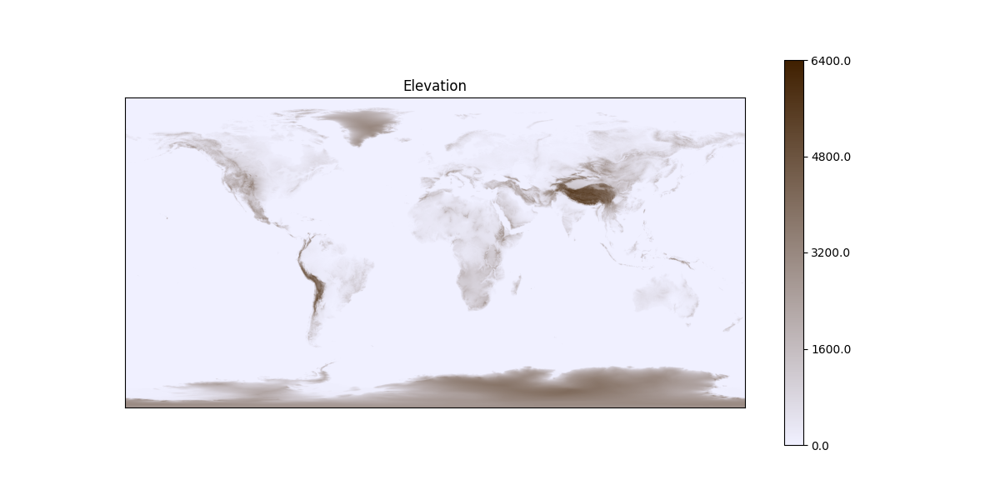
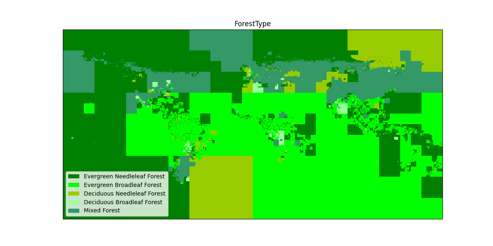
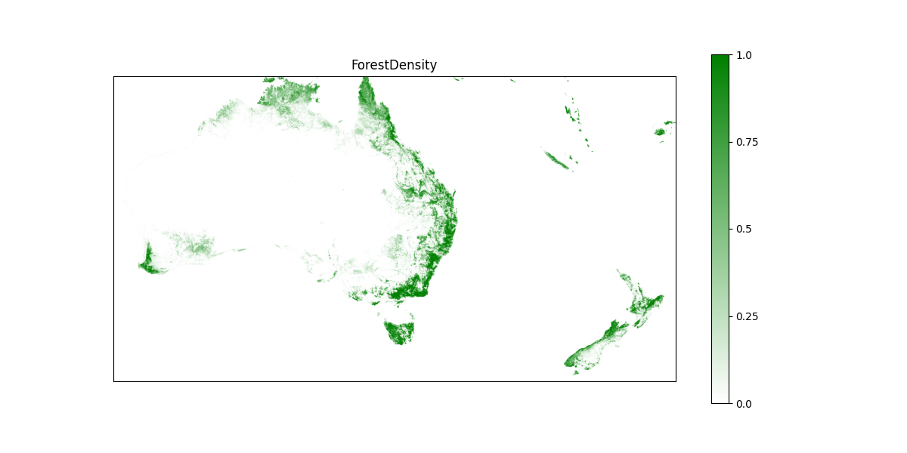
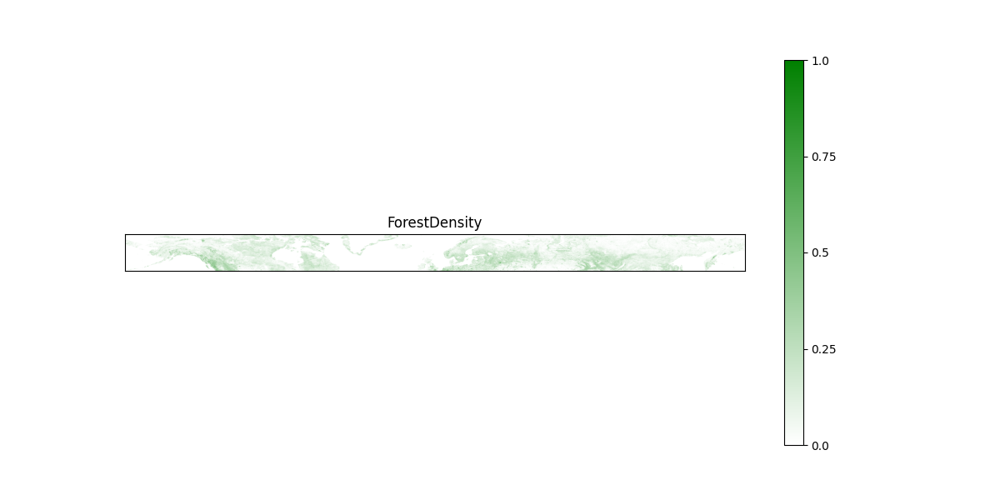

# Data Processor

The data processor produces landscape and forest maps from open datasets.

## Implementation

Key modules:
- `map_fragment` describes presentation model of output data as byte matrices that are stored in compressed format.
- `resource_manager` performs operations to load input data and save processed data.
- `map_producers` implements functions for processing input data into map fragments.
- `transformation` implements auxiliary operations to process data.
- `visual` can be used to visualize map fragments.

Map fragment is a matrix of uniform square cells bound to geographic coordinates.  
Fragment boundaries have integer geographic coordinates.  
The map scale specifies how many grid ticks are in a 1 degree segment.  
For instance, a map with scale of 20 has 20x20 cells per each 1x1 degree geographical square.

## Usage

Install requirements:
```commandline
pip install -r requirements.txt
```

An instance of `ResourceManager` should be used to manage input and output files.  
In most cases, map producers will load input data themselves with resource manager.  
Produced map fragments should typically be saved manually with resource manager.  
The *input* and *output* folders of data processor are ignored by Git so resources can be stored there.

Create a Resource Manager:
```python
resource_manager = ResourceManager("input", "output")
```

Save a map fragment to the output directory:
```python
resource_manager.save_map_fragment(fragment)
```

Visualize an elevation map fragment:
```python
draw_elevation(elevation_map_fragment)
```

### Elevation map

All 8 elevation TIFF input tiles from
[Topography](https://visibleearth.nasa.gov/images/73934/topography/83040l)
dataset need to be downloaded and placed in the `Elevation` folder inside the input directory.

Then `map_producers.elevation.save_produced_elevation_map`
should be used to produce and save the elevation map:
```python
elevation_map = save_produced_elevation_map(resource_manager)
```



### Forest type map

The land cover classification map image
[Land cover IGBP.png](https://en.wikipedia.org/wiki/File:Land_cover_IGBP.png)
must be downloaded and placed in the `LandCover` folder inside the input directory.

Then `map_producers.forest_type.save_produced_forest_type_map`
should be used to produce and save the forest type map:
```python
forest_type_map = save_produced_forest_type_map(resource_manager)
```



### Gedi forest density map

Canopy height TIFF input regions from
[GEDI Canopy Height](https://glad.umd.edu/dataset/gedi)
dataset must be downloaded and placed in the `GediCanopyHeight` folder inside the input directory.

This is the primary canopy height dataset covering most of the global area.

These input files are large and need to be processed gradually.

Use `map_producers.gedi_forest_density.save_produced_forest_density_regional_tiles`
to process input regional data tiles one by one:
```python
save_produced_forest_density_regional_tiles(resource_manager, Region.AUSTRALIA, 200, 1000)
```

This function is safe to interrupt.
To resume processing start from the last uncompleted tile, let's say it is `(117, -38)`:
```python
save_produced_forest_density_regional_tiles(resource_manager, Region.AUSTRALIA, 200, 1000, (117, -38))
```

Once the region is fully processed use
`map_producers.gedi_forest_density.save_forest_density_tile_combination`
to combine the produced tiles into a map fragment for that region:
```python
forest_density_fragment = save_forest_density_tile_combination(resource_manager, Region.AUSTRALIA, 200)
```



### Langnico forest density map

Canopy height TIFF input 3x3 degree tiles from the
[Langnico Canopy Height](https://www.research-collection.ethz.ch/handle/20.500.11850/609802)
dataset can be downloaded and placed in the `LangnicoCanopyHeight` folder inside the input directory.

This is a secondary dataset used to produce data for northern areas.

Use `map_producers.langnico_forest_density.save_downloaded_forest_density_tiles`
to download, process and save the necessary tiles:
```python
save_downloaded_forest_density_tiles(resource_manager, 200, 1000, (-180, 51), (360, 72 - 51))
```

This function is also safe to interrupt and the process can be continued from the last uncompleted tile,
let's say it is `(123, 54)`:
```python
save_downloaded_forest_density_tiles(resource_manager, 200, 1000, (123, 54), (180 - 123, 3))
save_downloaded_forest_density_tiles(resource_manager, 200, 1000, (-180, 57), (360, 72 - 57))
```

Produced tiles can be combined with
`map_producers.langnico_forest_density.save_forest_density_tile_combination`:
```python
forest_density_fragment = save_forest_density_tile_combination(resource_manager, 200, (-180, 51), (360, 72 - 51))
```



## Development

Install development requirements:
```commandline
pip install -r dev-requirements.txt
```

Format code:
```commandline
isort .
black .
autopep8 -air --exclude venv .
```
