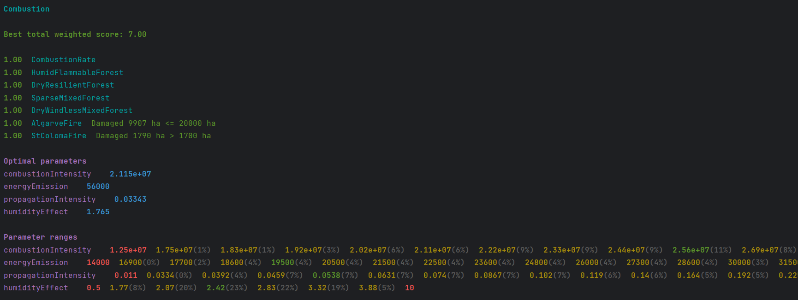

# Backend

The server-side is responsible for performing simulations.

## Implementation

The server-side implemented in Java using the Spring framework.

Top level packages:

- `api` implements API for the client-side.
- `data` describes map data presentation models and implements operations to read data from
  resources.
- `models` describes simulation-related models.
- `services` implements services.
- `tuner` implements auxiliary functionality for parameter adjustment of the cellular automaton
  algorithm.

Services:

- `AutomatonAlgorithm` implements cellular automaton state transition algorithm.
- `SimulationManager` stores active simulations.
- `Simulator` creates and performs simulations.
- `MosaicTerrainService` determines ground elevation, forest type, and density using map data from
  resources.
- `WeatherService` retrieves real-time weather data and has two implementations:
    - `WeatherApiService` fetches weather data from [WeatherAPI](https://www.weatherapi.com/).
    - `StandaloneWeatherService` serves as a mocked implementation for debugging.

## Tests

The backend part includes unit tests for cell, grid and map fragment models
and also for simulation manager and simulator services.

## Terrain and forest data

Map fragments produced by data processor should be moved to `maps` folder of backend resources.  
The fragments have to be loaded from resources in `ServiceConfig` with `MapLoader` and used to
initialize a `MosaicTerrainService` instance.

## Model parameter adjustment

`TunerApplication` from `tuner` package can be used to adjust
the parameters of the cellular automaton algorithm.  
`TunerApplication` runs a specified `Experiment` with a configured `TuneTask`,
iterating over different algorithm variations with parameter combinations from defined ranges.  
These variations are evaluated using a set of predefined `TuneCase` to identify the optimal
parameters.

As a result, the `TunerApplication` prints the parameters of the algorithm variation
that achieved the highest score.  
A summary of results for each parameter value is also displayed:
values colored in yellow indicate that at least one variation without tune case failures were found,
while values with the best success rate are colored in green.  
The success rate is displayed in parentheses next to each value
and represents the percentage of algorithm variations without failed test cases.

